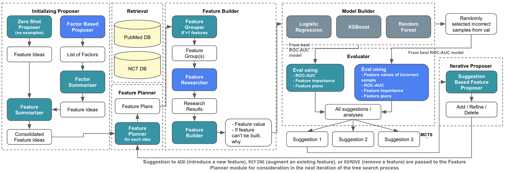

# AUTOCT: Automating Interpretable Clinical Trial Prediction with LLM Agents

This repository contains the implementation of the approach discussed in [AUTOCT: Automating Interpretable Clinical Trial Prediction with LLM
Agents](https://arxiv.org/abs/2506.04293).



## Setup

1. Clone the repository and navigate to the project directory.
2. Create the conda environment:
   ```
   conda env create -f environment.yml
   ```
3. Activate the environment:
   ```
   conda activate autoct
   ```
4. Set up required environment variables in a `.env` file or your shell.
    - The following environment variables are required for generating the retrieval dataset
        - PubMed
            - `ENTREZ_API_KEY`
            - `ENTREZ_EMAIL`
            - A free account is available on https://account.ncbi.nlm.nih.gov/ to increase the API request limit
    - The following environment variables are required for running the agent
        - OpenAI
            - `OPENAI_API_KEY`
5. The retrieval uses `pgvector` as the default backend. To run this locally, navigate to `db/` and run `docker-compose up`


## Usage

1. Run the data generation notebooks in order to prepare datasets.
2. Train the MCTS model using `scripts/train_mcts.py`.
3. Use `scripts/predict.py` to make predictions on new clinical trials.


## Project Structure

### `notebooks/`
Jupyter notebooks for generating the datasets:
- `0_generate_ctg.ipynb`: Generates clinical trial data from ClinicalTrials.gov.
- `1_generate_trialbench.ipynb`: Creates trial benchmark datasets.
- `2_clinical_trial_retrieval.ipynb`: Creates the RAG index for retrieval of clinical trial information.
- `3_generate_pubmed.ipynb`: Downloads and stores PubMed data.
    - A fixed list of PubMed document IDs that replicates what was used for the experiments is in `pmids.parquet`
- `4_clean_pubmed.ipynb`: Cleans and prepares PubMed datasets.
- `5_pubmed_retrieval.ipynb`: Creates the RAG index for retrieval of PubMed data.

### `scripts/`
Python scripts for running the system:
- `run_agent.py`: Executes a single iteration of the end to end LLM agent.
- `train_mcts.py`: Runs the Monte Carlo Tree Search (MCTS) algorithm for feature exploration.
- `predict.py`: Extracts the best performing model from a run of MCTS and runs prediction for a given task and trial ID.

### `src/lfe/impl/`
Core implementation modules:
- `agent.py`: Main agent logic using DSPy framework for LLM interactions and feature engineering.
- `treesearch.py`: Implements Monte Carlo Tree Search for exploring feature engineering plans.
- `pubmed.py`: Handles PubMed data retrieval and processing using BioPython's Entrez API.
- `tools.py`: Search tools for clinical trials and PubMed using embeddings.
- `utils.py`: General utility functions.
- `globals.py`: Global configurations and shared resources.

### `tasks/`
These are subsets of the TrialBench Dataset as used by the paper for different clinical trial prediction tasks:
- `adverse_event/`: Predict adverse events in clinical trials.
- `failure_reason/`: Predict reasons for trial failure.
- `mortality/`: Predict mortality outcomes.
- `patient_dropout/`: Predict patient dropout rates.
- `trial_approval/`: Predict trial approval likelihood.

Each task directory contains train/validation/test splits in Parquet format.
